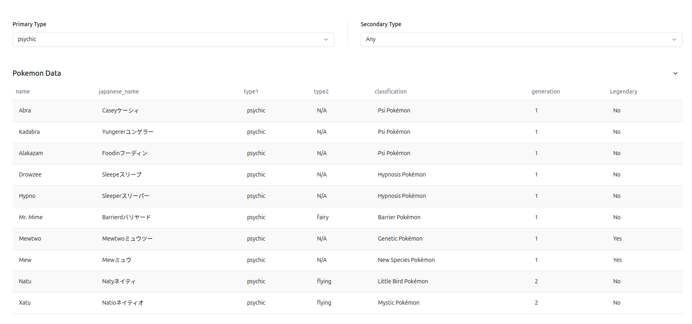
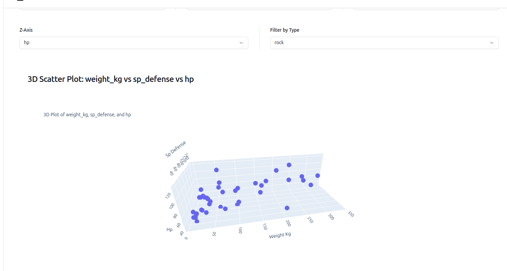
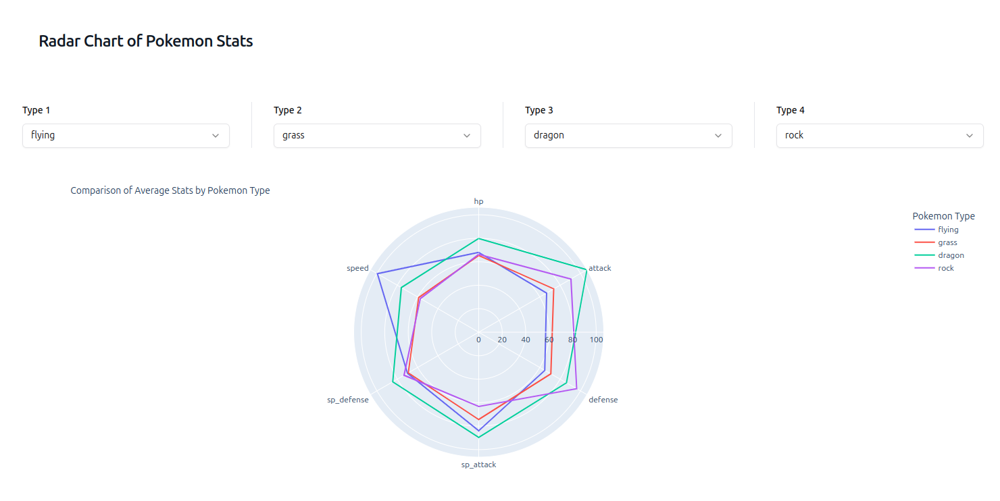
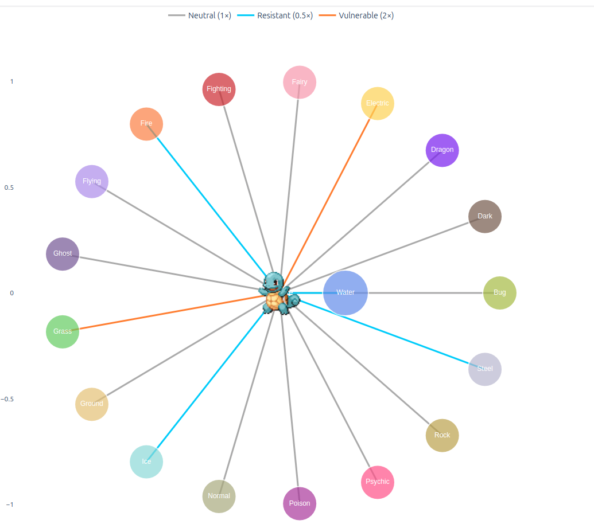

# Pokemon Data Visualization

This interactive application provides comprehensive visualization and analysis tools for exploring Pokemon data. Users can browse, filter, and analyze Pokemon statistics, types, and type effectiveness relationships.

## Features

- **Data Browsing**: View and filter Pokemon by primary and secondary types
<p align="center">
  
</p>

- **Interactive Visualizations**: Multiple visualization types including:

  - Scatter plots with customizable axes
  - Histograms and box plots for statistical analysis
  - Bar charts for categorical comparisons
  - Radar charts to compare Pokemon types
  - 3D scatter plots for multi-dimensional analysis
    <p align="center">
    
  </p>

  <p align="center">
    
  </p>

- **Type Effectiveness Network**: Interactive network visualization showing:
  <p align="center">
    
  </p>

  - Type effectiveness relationships for any Pokemon
  - Color-coded connections showing vulnerabilities and resistances
  - Integration with PokeAPI to display Pokemon sprites
  - Visual representation of immunity, resistance, and vulnerability

## Data Source

The application uses a comprehensive Pokemon dataset from:
https://www.kaggle.com/datasets/rounakbanik/pokemon/data?select=pokemon.csv

Download the CSV file and place it in the data folder.

The dataset includes:

- Base stats (HP, Attack, Defense, etc.)
- Type information
- Generation data
- Legendary status
- Type effectiveness values

## Run the app

To run the app, you can use the following command:

```
preswald run
```

## Usage

1. Use the filters at the top to browse Pokemon by type
2. Select a visualization type from the dropdown menu
3. Configure the visualization using the provided options
4. Enter a Pokemon name to view its type effectiveness network
