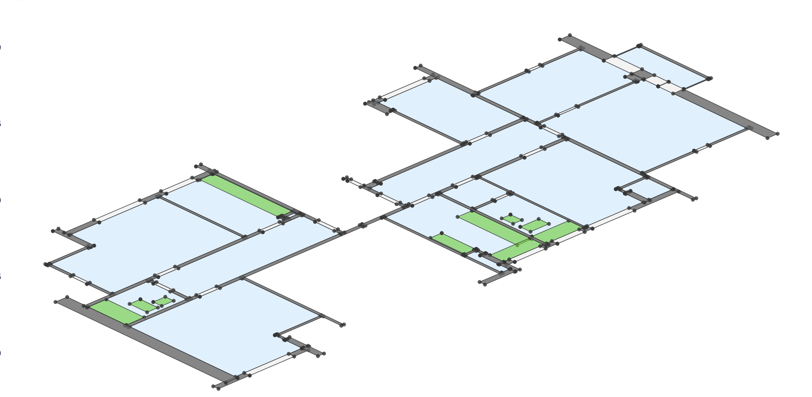

<p align="center">
  
</p>

This application provides an interactive way to explore and visualize architectural data from Swiss apartments, buildings, and floor plans. Built with Preswald, it allows users to navigate through a hierarchical structure of sites, buildings, floors, and apartments while visualizing their geometries.

<p align="center">
  
  <br>
  <em>Example visualization of an apartment floor plan with color-coded elements</em>
</p>

## Features

- **Hierarchical Navigation**: Explore sites → buildings → floors → apartments
- **Interactive Visualization**: View floor plans and apartment layouts with color-coded elements
- **Data Exploration**: See entity distributions and sample data from the dataset
- **Toggle Controls**: Show/hide legends to manage visualization complexity

## Dataset

The application uses a comprehensive dataset of Swiss apartment geometries containing:

- **Areas**: Rooms, bathrooms, kitchens
- **Separators**: Walls, railings
- **Openings**: Windows, doors
- **Features**: Sinks, toilets, bathtubs, etc.

Each element includes spatial data in WKT format and hierarchical information about its location within the building.

[Download the dataset here](https://zenodo.org/records/7070952#.Y0mACy0RqO0)

## Getting Started

### Prerequisites

- Python 3.7+
- Virtual environment (recommended)

### Installation

1. Clone the repository:
   ```bash
   git clone https://github.com/StructuredLabs/preswald.git
   cd Swiss_Apartment_Models
   ```

2. Create and activate a virtual environment:
   ```bash
   python -m venv venv
   source venv/bin/activate  # On Windows: venv\Scripts\activate
   ```

3. Install required packages:
   ```bash
   pip install -r requirements.txt
   ```

### Running the App

Start the application locally:

```bash
preswald run
```

Open your browser and navigate to http://localhost:8501

## Built With

- [Preswald](https://preswald.com) - Python framework for building data apps
- [Plotly](https://plotly.com) - Interactive visualization library
- [Pandas](https://pandas.pydata.org) - Data manipulation library
- [Shapely](https://shapely.readthedocs.io) - Geometric operations library

## Acknowledgments

- Data provided by the Swiss building and housing database
- Built using Preswald by Structured Labs