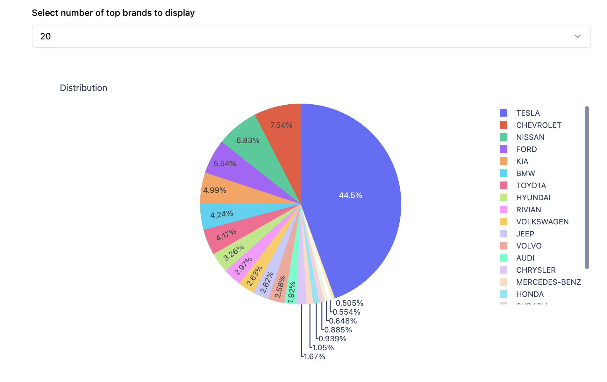
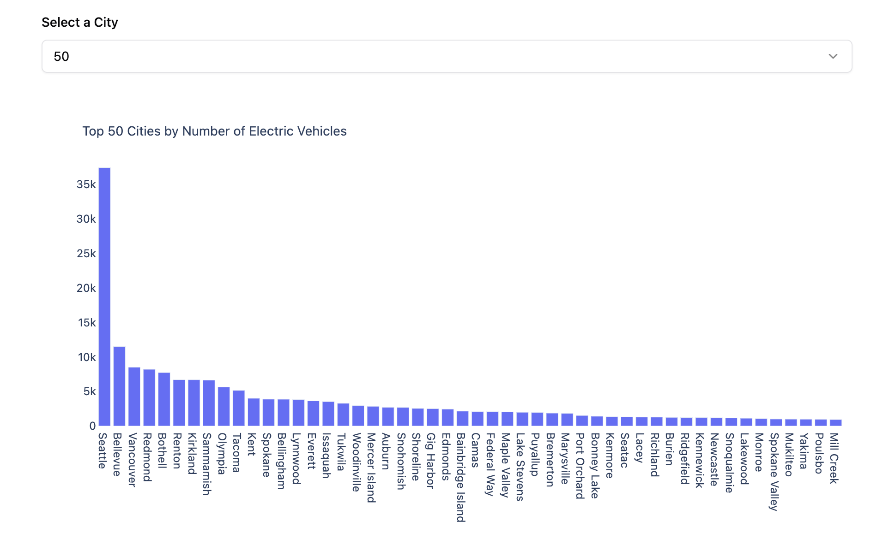
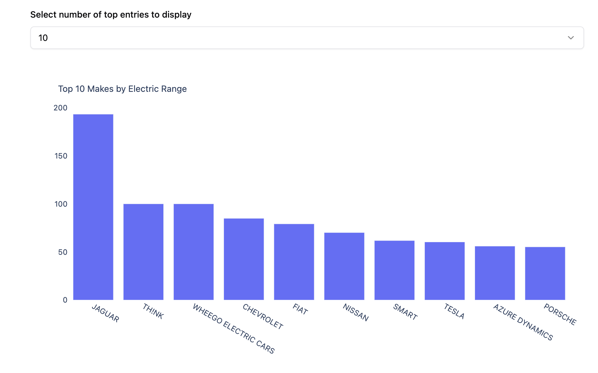

# Electric Vehicles in Washington DC

## Overview
Electric Vehicles in Washington DC is an interactive application built using **Preswald** providing insights into electric vehicles that can be found in Washington DC, users can query based on cities, counties, make, and also there is a geo chart showing the location of each vehicle.

## Dataset
The dataset used in this project is stored as a CSV file (`Electric_Vehicle_Population.csv`). The dataset contains the following columns:
- `County`: County in Washington DC
- `City`: City in Washington DC
- `Make`: Maker of the Electric Vehicle
- `Model Year`: Year the Electric Vehicle was made
- `Electric Range`: Range that the Electric Vehicle can go on a single full charge
- `Vehicle Location`: Coordinate where the Electric Vehicle was located


## Visualizations




This dataset can be used for:
- Finding the cities with the most electric vehicles based on frequency (bar chart).
- Checking top electric vehicle makers(pie chart)
- Displaying geo chart showing the location of each vehicle
- Making a comparison of the electric vehicle make vs electric range

## How to Run the Application

### Prerequisites
Ensure that you have Python installed and the required dependencies installed. You will also need **Preswald** for running the interactive application.

### Installation Steps
1. Clone the repository:
   ```bash
   git clone <repository-url>
   cd electric-vehicle
   ```

2. Install dependencies:
   ```bash
   pip install pandas plotly preswald
   ```

3. Run the application:
   ```bash
   preswald run
   ```

### Deploying the App in Preswald
The app can be deployed in **Preswald Structured Cloud** using the following steps:

1. **Get an API Key**
   - Go to [app.preswald.com](https://app.preswald.com)
   - Create a **New Organization** (top left corner)
   - Navigate to **Settings > API Keys**
   - Generate and copy your **Preswald API Key**

2. **Deploy Your App**
   Run the following command in your terminal, replacing `<your-github-username>` and `<structured-api-key>` with your actual credentials:
   ```bash
   preswald deploy --target structured --github <your-github-username> --api-key <structured-api-key> hello.py
   ```

3. **Verify the Deployment**
   - Once deployment is complete, a **live preview link** will be provided.
   - Open the link in your browser and verify that your app is running.

### Live Demo
You can access the deployed application here:
[Electric Vehicle in Washington DC](https://preswald-assessment-578866-zopfgvwx-ndjz2ws6la-ue.a.run.app/)