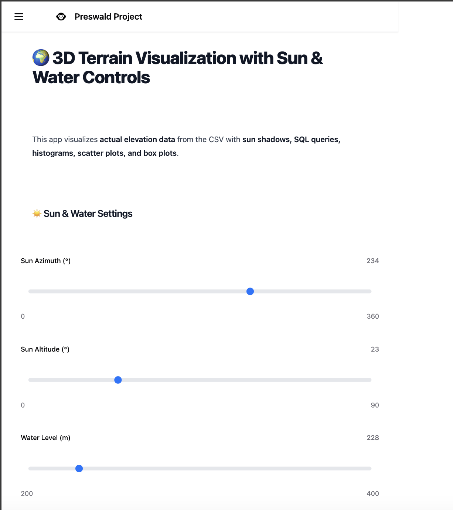
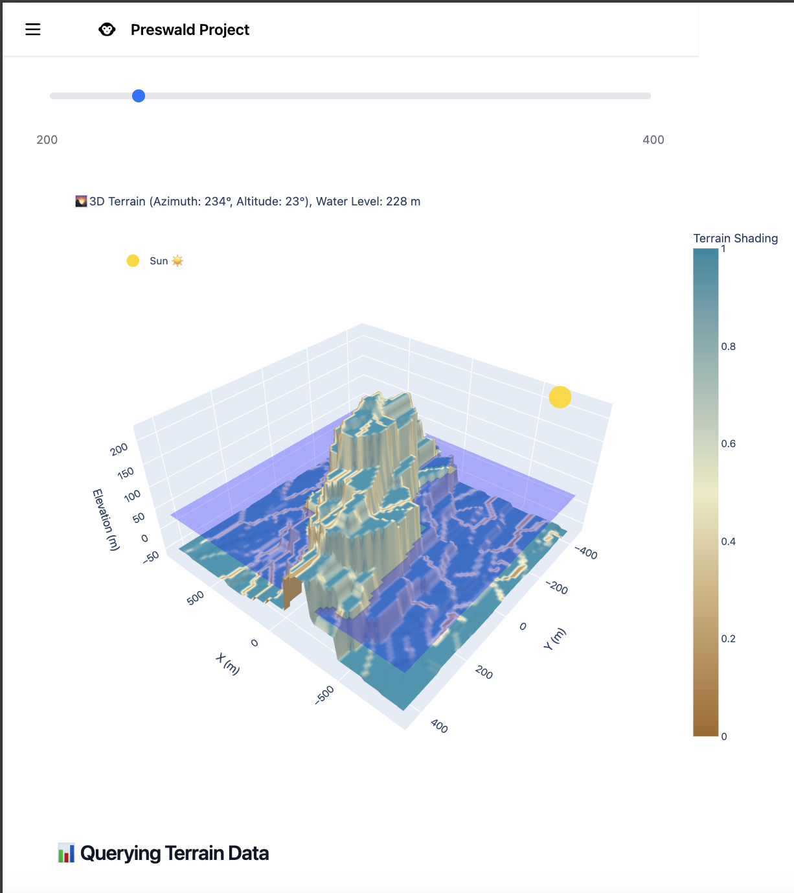
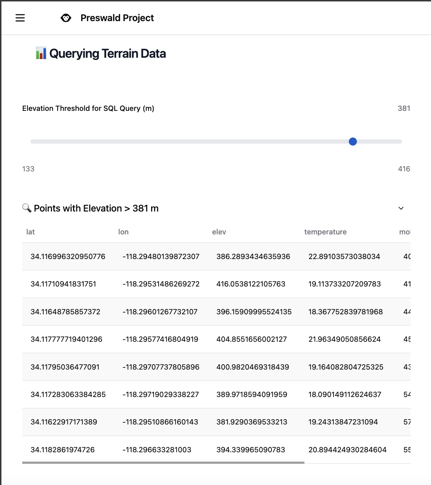
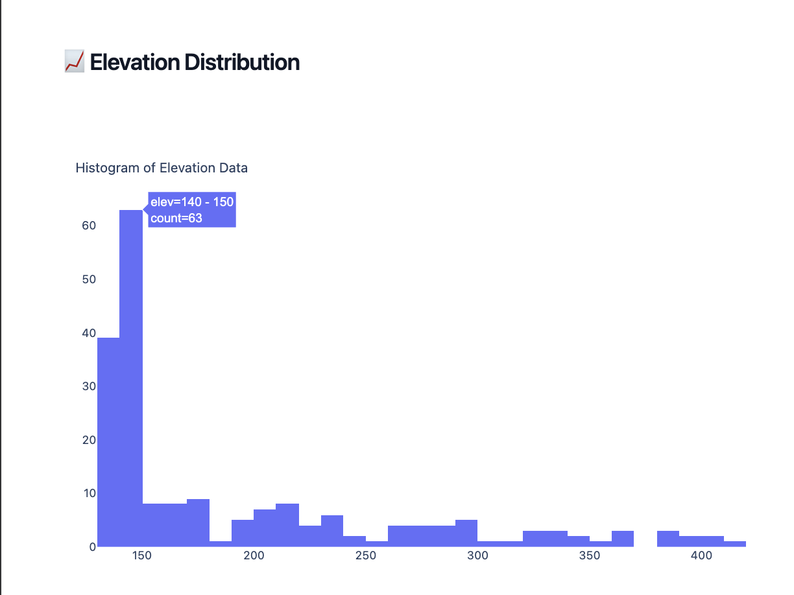
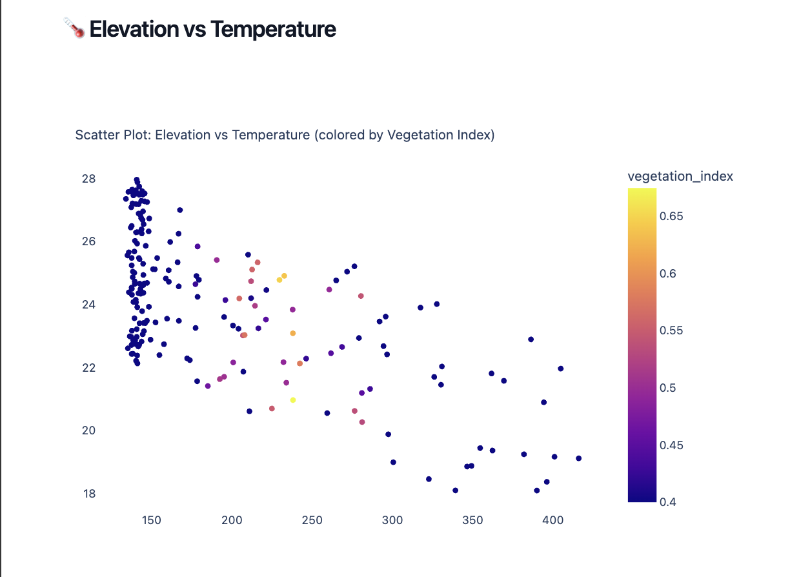
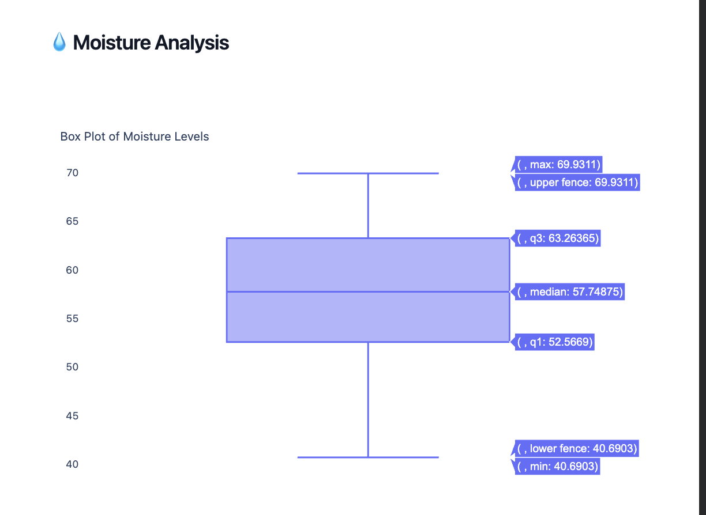

# 🌍 3D Terrain Visualization with Sun & Water Controls

🔗 **Live Demo**: [Visit the App](https://hill-shadow-827014-0bvg2ju1-ndjz2ws6la-ue.a.run.app)

## 🌐 Overview
This interactive dashboard visualizes terrain data from a custom-generated CSV dataset. It provides insights into terrain elevation, temperature, moisture, and vegetation indices. The app includes:

- **Interactive 3D Terrain Visualization** with adjustable sun positioning and water levels.
- **SQL Querying** to filter terrain data based on elevation thresholds.
- **Elevation Distribution Analysis** with histograms.
- **Scatter Plots** analyzing elevation vs temperature, colored by vegetation index.
- **Box Plot** for moisture level analysis.

## 📂 Dataset Source
The dataset used in this project is a synthetic CSV file named `sample.csv`, generated with Python. It includes the following columns:

- `lat`: Latitude coordinates of terrain points.
- `lon`: Longitude coordinates of terrain points.
- `elev`: Elevation in meters.
- `temperature`: Temperature in Celsius.
- `moisture`: Moisture percentage.
- `vegetation_index`: Vegetation health index (range: 0-1).

This synthetic dataset provides a realistic basis for visualizing and analyzing terrain features.

## 🚀 What Does the App Do?
The **3D Terrain Visualization App** provides the following functionalities:

- **Sun & Water Controls**: Adjust sun azimuth, altitude, and water level dynamically.
- **3D Terrain Visualization**: View realistic terrain with interactive shading based on sunlight position.
- **SQL Query Integration**: Query terrain points above specified elevation thresholds.
- **Elevation Analysis**: View distribution of elevation data through histograms.
- **Elevation vs Temperature**: Explore scatter plots colored by vegetation index.
- **Moisture Analysis**: Analyze moisture distribution using box plots.

This app enables interactive exploration and comprehensive analysis of terrain data in a visually appealing manner.

## 🖥️ Screenshots

1. **Main page with sun and water controls**  
   

2. **Interactive 3D terrain view**  
   

3. **SQL query for elevation filtering**  
   

4. **Elevation histogram**  
   

5. **Scatter plot (Elevation vs Temperature)**  
   

6. **Box plot for moisture analysis**  
   

## ⚙️ How to Run the App Locally

### 📋 Prerequisites

1. **Install Python**: Python 3.7 or higher is required. [Download Python](https://www.python.org/downloads/).
2. **Install Dependencies**:
   ```sh
   pip install pandas plotly preswald numpy
   ```

### 🚦 Running the App

1. **Clone the repository** or download the project files.
2. **Prepare the Dataset**:
   - Ensure `sample.csv` is placed correctly in the `data/` directory.
3. **Run the App**:
   ```sh
   preswald run
   ```
4. **Open the app** at the provided local URL (e.g., `http://localhost:8501/`).

## 🌐 How to Deploy the App

### 📌 1. Deploying with Preswald (Development)

1. Generate your API key at [Preswald API Keys](https://preswald.com/api-keys).
2. Deploy using:
   ```sh
   preswald deploy --target structured --github <your-github-username> --api-key YOUR_API_KEY
   ```
   Replace `YOUR_API_KEY` with your actual API key.

### 📌 2. Deployment Steps

1. **Create a New Organization**: Visit [Preswald](https://preswald.com) and create a new organization.
2. **Generate an API Key**: Navigate to `Settings → API Keys`.
3. **Deploy**: Use the `preswald deploy` command above.
4. A live URL will be provided after deployment.

## ✨ Additional Notes

- Ensure dataset accuracy and format before deployment.
- Customize further by adjusting terrain visualization parameters or expanding data analysis.

Enjoy exploring and visualizing your terrain data interactively! 🌄📊🚀
