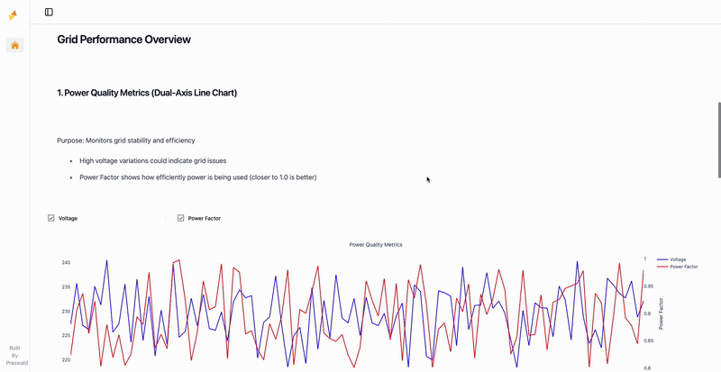

# Smart Grid Load Monitoring Analysis Dashboard

## Overview
This Preswald dashboard provides an interactive analysis platform for smart grid data, focusing on power quality metrics, renewable energy integration, and system health monitoring. The application enables users to explore historical smart grid data through various visualizations and interactive controls.

## Preview


## Features

### 1. Time-Based Data Filtering
- Dynamic filtering based on available data
- Flexible time granularity options (Year/Month/Day)

### 2. Power Quality Metrics
Interactive visualization showing:
- Voltage levels over time
- Power Factor measurements
- Toggle controls for individual metrics

### 3. Grid Supply Source Analysis
Stacked area chart displaying:
- Solar power contribution
- Wind power contribution
- Grid supply levels
- Individual source toggling
- Interactive hover details

### 4. Environmental Impact Analysis
Scatter plot visualization showing:
- Temperature vs. Power consumption relationship
- Humidity impact through color intensity
- Interactive data points with detailed information

## Running the Project Locally

1. Install Preswald:
```bash
pip install preswald
```

2. Clone this repository:
```bash
git clone https://github.com/StructuredLabs/preswald.git
cd examples/smart_grid_analysis
```

3. Run the application:
```bash
preswald run
```

The dashboard will be available at `http://localhost:8501`

## Usage Guide

1. **Date Selection**:
   - Choose the year from available options
   - Select month (filtered based on year)
   - Pick day (filtered based on year and month)
   - Select time granularity for analysis

2. **Visualization Controls**:
   - Use checkboxes to toggle different metrics
   - Hover over graphs for detailed information
   - Interact with legends to filter data

3. **Analysis Features**:
   - Compare power quality metrics
   - Analyze renewable energy contribution

## Technical Implementation
- Built using Preswald framework
- Utilizes Plotly for interactive visualizations
- Implements dynamic data filtering

## Deployment

To deploy this dashboard to Preswald Cloud:

1. Get your API key from [app.preswald.com](https://app.preswald.com)

2. Deploy using:
```bash
preswald deploy --target structured
```
The first time you deploy, you'll be prompted to enter your GitHub username and Preswald API key. After that, your app will be built, deployed, and accessible online.

3. Access your deployed dashboard at the URL provided after successful deployment
